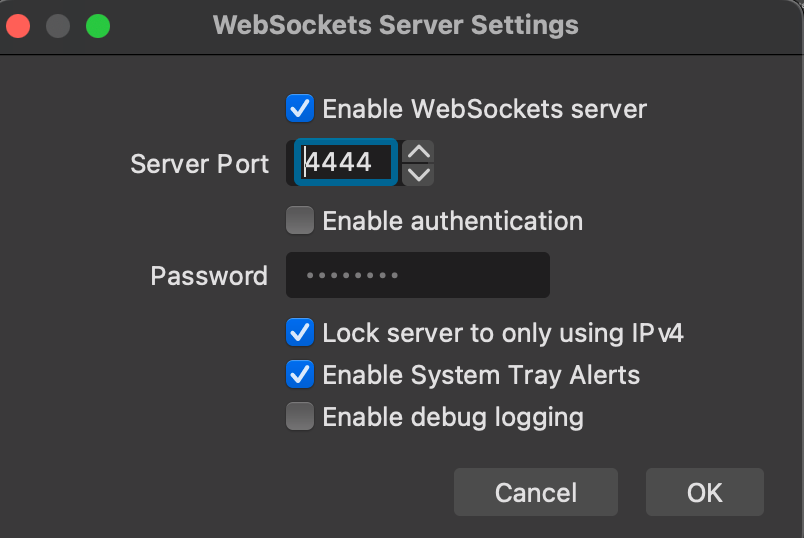

## OBS Controller

Use this app to control the OBS recording in an easy way.

### But you need to do the following first
1. install obs-websocket: https://github.com/obsproject/obs-websocket/releases

2. config it:

### How to Use
After you run, at the top menu bar, you shall see a little circle icon, click it to start or stop the recording